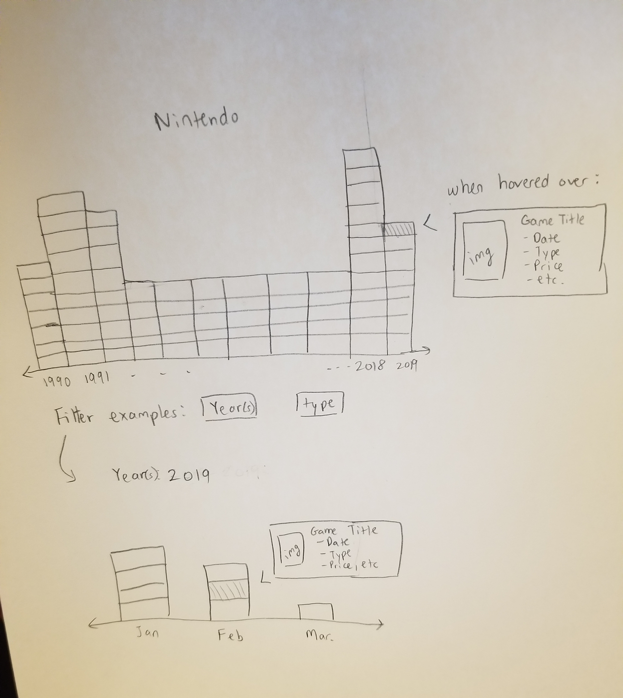

# P#04 -- Team calm_squid_salsa

## Devos of Period 7
* Tina Wong
* Emily Lee
* Jason Lin
* Isaac Jon

### Description of data set
Source: [json of Nintendo data](https://www.nintendo.com/json/content/get/filter/game?limit=400)

This dataset includes:
- titles of Nintendo games
- release date
- number of players needed to play
- type of game
- price
- front cover art
- system, etc

Because there are so many Nintendo games, we will use this dataset to create a timeline for users to view this information on the Nintendo games in a clear and manageable format. We are interested in seeing if there is a trend for what types of games are released during certain years.

### Explanation
User interaction is necessary to view the information about specific games in the timeline. The games would be on the timeline organized by start date, and when the user hovers over them, information about the game will show up, including the type of game, system, etc.

Filters can be implemented to give the user only specific information they request, such as games only within specific years, or only games of a certain type.

### Explanation of D3 features
We will use enter/exit selections for filtering. If a certain game does not fit the query, such as games developed in 2019, it will be removed from the DOM by exit selections so that it is not displayed, and can be added to the data again through enter selections if the element matches the user's query. We would also like to use event listeners in D3 in order to add the element of interactivity when hovering over a specific bar from a year.

A example of data visualization that is similar to what we want to have can be found [here](http://guernica.museoreinasofia.es/cronologia/en/).

### Sketch
Sketch:


### LAUNCH CODES
1. First, clone this repository:
```
$ git clone https://github.com/ecrystale/P04.git
```
2. Next, change your directory to go into your local copy of the repository:
```
$ cd P04
```
3. Activate your virtual environment. If you do not have one set up, you may create one in the current working directory, and activate it like so:
```
$ python3 -m venv venv
$ . venv/bin/activate
```
4. Run the following command to install all the packages needed for the data visualization to display on the Flask server:
```
(venv) $ pip install -r requirements.txt
```
5. Now, activate your virtual environment and run the python file to start the Flask server:
```
(venv) $ python3 app.py
```
6. Visit the website at [http://localhost:5000/](http://localhost:5000/)
